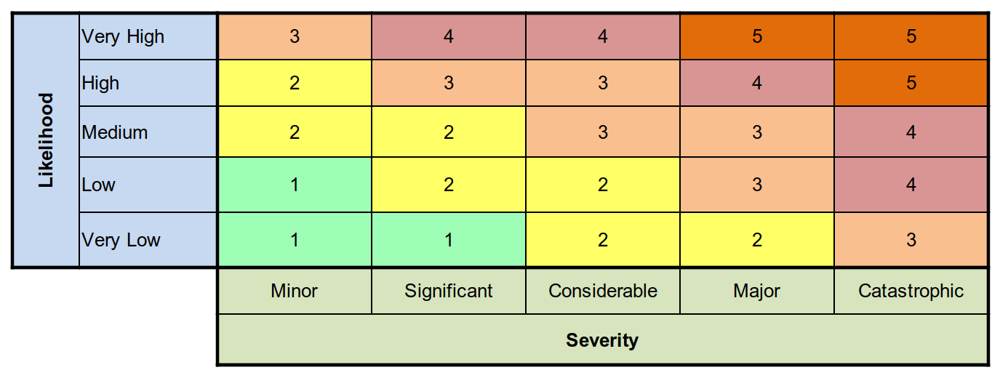

# Endeavour Predict Hazard Log

In keeping with our commitment to transparency and openness, our Hazard Log is publicly visible and managed in GitHub using the Issues feature.

Each Issue represents a Hazard potentially affecting the project.

Hazards can be viewed (and indeed commented on, discussed, and improved) at the URL below:

<https://github.com/endeavour-predict/endeavourpredict.org/issues>

Instead of the more usual and somewhat outdated and chaotic 'spreadsheet' model, often used for Hazard Logs, we are using the [Issues](https://github.com/endeavour-predict/www.endeavour-predict.net/issues/issues) facility in GitHub to record Hazards.

- _Labels_ are used to annotate Hazard Issues with `severity-` and `likelihood-` scores, from which we can derive a `risk-level-`. See all Labels [here](https://github.com/endeavour-predict/www.endeavour-predict.net/issues/labels)

- _Milestones_ are used to designate the Initial Risk Assessment and Residual Risk Assessment. See all Milestones [here](https://github.com/endeavour-predict/www.endeavour-predict.net/issues/milestones)

Most importantly, the **discussion and evidence** relating to any given risk is included in the recording of the risk. A complete history of the labelling is kept in the issue. Spreadsheet-based risk and hazard handling is inferior to this model, because spreadsheets are unsuited to discussion, text handling, and long-form discourse.

> A Hazard which is _never_ recorded in any Spreadsheet-based Hazard Log is 'Accidental deletion of a Hazard before it has been mitigated/risk-eliminated', yet anyone who has used a spreadsheet knows how easy it is to accidentally delete or modify a cell or row inadvertently.
> Put simply, a spreadsheet is a poor choice of technology for managing text and a totally unacceptable choice of technology for handling Hazards, yet it has become the industry standard across the NHS simply because the Hazard Log template issued by NHS Digital is a spreadsheet. Building and releasing an open source, free **Hazard Log management platform** would have been much a better approach, which NHS DIgital had ans still has the resources to do, but lack of understanding about the case of need limits their capability to execute on this.

## Monitoring of Risk

Using the Label search feature, one can search for Hazards at any Risk Level, in order to triage the most risky Hazards for further action.

[risk-level-5-unacceptable](https://github.com/endeavour-predict/www.endeavour-predict.net/issues/labels/risk-level-5-unacceptable)  
[risk-level-4-mandatory-risk-elimination](https://github.com/endeavour-predict/www.endeavour-predict.net/issues/labels/risk-level-4-mandatory-risk-elimination)  
[risk-level-3-undesirable](https://github.com/endeavour-predict/www.endeavour-predict.net/issues/labels/risk-level-3-undesirable)  
[risk-level-2-acceptable](https://github.com/endeavour-predict/www.endeavour-predict.net/issues/labels/risk-level-2-acceptable)  
[risk-level-1-acceptable](https://github.com/endeavour-predict/www.endeavour-predict.net/issues/labels/risk-level-1-acceptable)

- We can filter for multiple labels.

## Hazard Deletion

Hazards are **never** deleted but may be _closed_ if there is no residual hazard and they are no longer relevant.

## Alternative views

Using the [GitHub Projects](hhttps://github.com/endeavour-predict/www.endeavour-predict.net/issues/projects) you can create a tabular (Excel-style) view, or a Kanban (Trello) view of your Hazards. Using built-in GitHub Issues and Pull Requests features you can link Hazards to their mitigations in code, to show a chain of evidence of clinical safety improvements.

## Creating a Hazard

1. Navigate to [Issues](https://github.com/endeavour-predict/www.endeavour-predict.net/issues/issues)
2. Click on New Issue
3. Use the **Hazard Issue Template** to guide you through adding the necessary information.
4. Label according to Severity and Likelihood, then calculate Risk Level.
5. Assign to CSO @pacharanero.
6. Save by 'committing' to the repository.
7. Review and ensure complete.
8. Invite others to review and comment using @mention or by sharing the URL

## Risk Matrix and Acceptability Criteria

